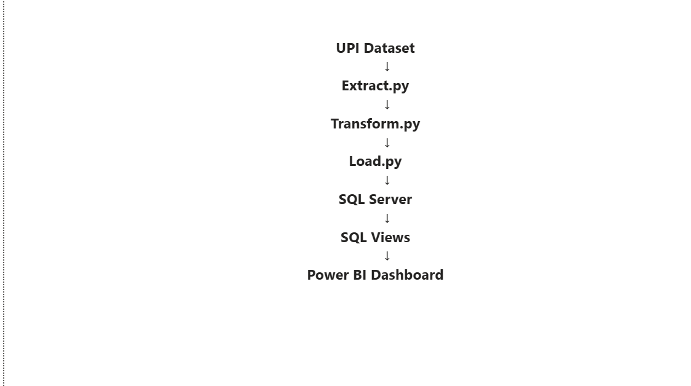
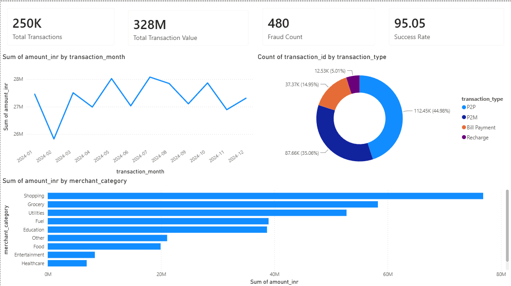
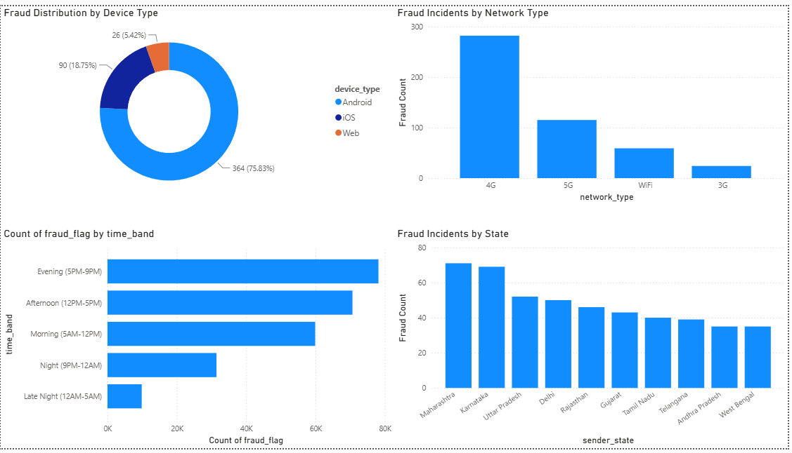
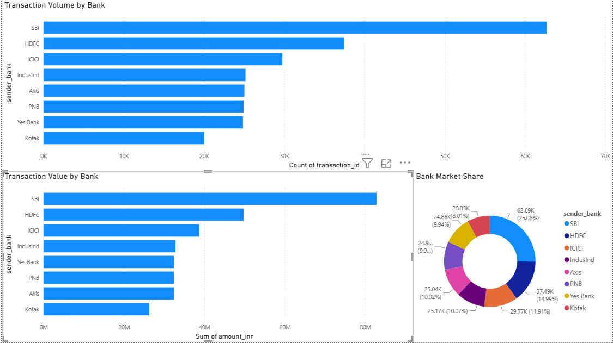
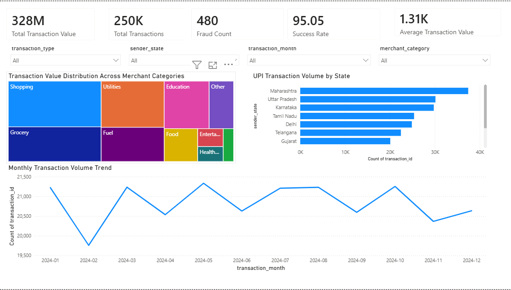

# UPI Transaction Analytics Platform

## Project Highlights

✔ Processed 250,000+ UPI Transactions

✔ Built Automated Python ETL Pipeline

✔ Loaded Data into SQL Server

✔ Created Analytical SQL Views

✔ Developed 4 Interactive Power BI Dashboards

✔ Generated Fraud, Merchant & Bank Performance Insights

---

# Project Overview

The UPI Transaction Analytics Platform is an end-to-end data analytics solution designed to analyze digital payment transactions and generate actionable business insights.

The project processes over **250,000 UPI transactions** using **Python, SQL Server, and Power BI** to monitor transaction performance, fraud activity, merchant behavior, and bank-level trends.

This platform demonstrates the complete analytics lifecycle from data extraction and transformation to business reporting and decision support.

---

# Business Problem

Digital payment providers process millions of transactions daily.

Monitoring transaction success rates, fraud incidents, merchant performance, and customer activity manually is inefficient and time-consuming.

Organizations require a centralized analytics platform to:

- Track transaction performance
- Detect fraud patterns
- Monitor bank performance
- Understand customer behavior
- Support business decision-making

This project addresses these challenges through an automated ETL and analytics pipeline.

---

# Business Questions Solved

### 1. Which banks process the highest transaction volume?

The analysis identifies leading banks by transaction count and transaction value, helping understand market share and customer adoption.

### 2. Which merchant categories generate the highest transaction value?

Merchant category analysis highlights the sectors driving the majority of payment activity.

### 3. Which states exhibit the highest fraud activity?

Fraud trends are analyzed geographically to support risk management and fraud monitoring.

### 4. How does transaction volume vary across months?

Monthly trend analysis helps identify seasonality and changes in customer spending behavior.

### 5. What is the overall transaction success rate?

Success rate analysis measures payment reliability and operational efficiency.

### 6. Which device types are most associated with fraud?

Fraud incidents are analyzed across Android, iOS, and Web channels to identify risk patterns.

### 7. Which customer segments generate the most transactions?

Customer segmentation based on demographics helps identify the most active user groups.

---

# Dataset Description

| Attribute | Details |
|------------|------------|
| Dataset | UPI Transactions 2024 |
| Source | Kaggle |
| Records | 250,000+ |
| Columns | 24 |
| Domain | FinTech / Digital Payments |
| Time Period | 2024 |
| Format | CSV |

### Key Attributes

- Transaction ID
- Transaction Timestamp
- Transaction Type
- Merchant Category
- Transaction Amount
- Transaction Status
- Sender State
- Sender Bank
- Receiver Bank
- Device Type
- Network Type
- Fraud Flag

---

# Project Architecture

---

# Dashboard Screenshots

## Executive Overview Dashboard

Provides a high-level view of transaction activity, payment success rates, fraud monitoring, and merchant performance.

---

## Fraud Analytics Dashboard

Identifies fraud patterns across states, device types, and network channels to support risk monitoring.

---

## Bank Performance Dashboard

Compares transaction volume, transaction value, and market share across major banks.

---

## Executive Dashboard

Interactive dashboard for exploring transaction trends, merchant behavior, customer activity, and geographic insights.

---

# Technology Stack

### Programming

- Python

### Data Processing

- Pandas
- NumPy

### Database

- SQL Server
- SQLAlchemy
- PyODBC

### Data Visualization

- Power BI

### Version Control

- Git
- GitHub

---

# ETL Pipeline

## Extract

- Read raw transaction dataset
- Validate schema
- Load CSV into DataFrame

## Transform

Created business-ready columns:

- transaction_date
- transaction_month
- transaction_quarter
- amount_bucket
- fraud_status
- transaction_outcome
- week_type

Performed:

- Date conversion
- Feature engineering
- Category standardization
- Business rule implementation

## Load

- Saved processed dataset
- Loaded data into SQL Server
- Enabled SQL analytics and reporting

---

# Data Cleaning & Transformation

To improve data quality and reporting accuracy:

### Data Quality Checks

- Validated transaction amounts
- Standardized categorical values
- Converted timestamps to datetime format
- Created reporting dimensions

### Feature Engineering

Generated additional analytical fields:

- Transaction Month
- Transaction Quarter
- Amount Buckets
- Fraud Status
- Week Type
- Transaction Outcome

These features improved dashboard reporting and business analysis.

---

# SQL Analytics

The processed dataset was loaded into SQL Server and analytical views were created.

### SQL Views Created

#### Daily Transaction Summary

Tracks:

- Daily transaction volume
- Daily transaction value
- Success rate

#### Fraud Analysis

Tracks:

- Fraud count by state
- Fraud count by device type
- Fraud count by network type

#### Bank Performance Analysis

Tracks:

- Bank transaction volume
- Bank transaction value
- Bank market share

### SQL Operations Used

- Aggregations
- GROUP BY
- CASE Statements
- SQL Views
- Filtering
- Sorting
- Ranking Analysis

---

# Power BI Dashboards

### Executive Overview

- Total Transactions
- Transaction Value
- Success Rate
- Fraud Count
- Monthly Trends

### Fraud Analytics

- Fraud by State
- Fraud by Device
- Fraud by Network

### Bank Performance

- Bank Market Share
- Transaction Volume
- Transaction Value

### Executive Dashboard

- Interactive Filters
- Merchant Analysis
- State Analysis
- Monthly Trends
- KPI Tracking

---

# Key Performance Indicators (KPIs)

| KPI | Business Importance |
|-------|--------------------|
| Total Transactions | Measures platform activity |
| Transaction Value | Indicates payment volume and revenue potential |
| Success Rate | Measures transaction reliability |
| Fraud Count | Supports risk monitoring |
| Bank Market Share | Competitive benchmarking |
| Merchant Contribution | Revenue source analysis |

---

# Key Business Insights

### Transaction Insights

- Processed over 250,000 transactions.
- Achieved a transaction success rate above 95%.
- Transaction activity remained stable throughout the year.

### Merchant Insights

- Shopping and Grocery categories generated the highest transaction value.
- Utilities and Fuel categories contributed significantly to transaction volume.

### Fraud Insights

- Fraud activity represented a very small percentage of overall transactions.
- Android devices recorded the highest fraud count.
- Fraud patterns varied across states, highlighting regional risk differences.

### Banking Insights

- SBI processed the highest transaction volume.
- HDFC and ICICI followed as major contributors.
- Bank-level performance analysis highlighted customer adoption trends.

---

# Project Outcomes

- Built a complete ETL pipeline using Python.
- Processed 250,000+ UPI transactions.
- Loaded transformed data into SQL Server.
- Created SQL views for business reporting.
- Developed 4 interactive Power BI dashboards.
- Generated fraud monitoring and banking insights.
- Demonstrated an end-to-end analytics workflow used in BFSI organizations.

---

# Future Improvements

- Real-time transaction ingestion
- Fraud prediction using Machine Learning
- Customer Segmentation Models
- Automated Dashboard Refresh
- Azure Cloud Deployment
- Streamlit Web Application

---

# Author

## Varad Gandhi

Final Year Dual Degree Student

- B.E. Electronics & Computer Science
- B.Sc. Data Science (IIT Madras)

### Skills

Python • SQL • Power BI • Excel • SQL Server • Azure • Microsoft Fabric • ETL Pipelines • Data Analytics

---